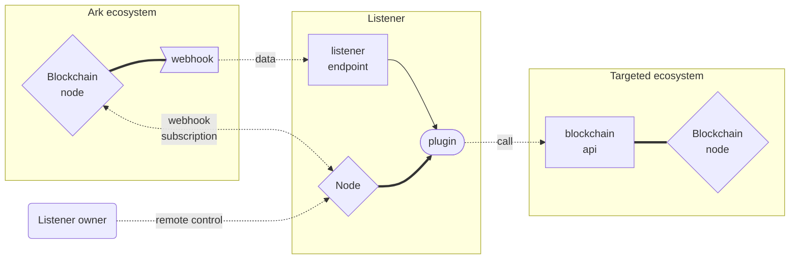
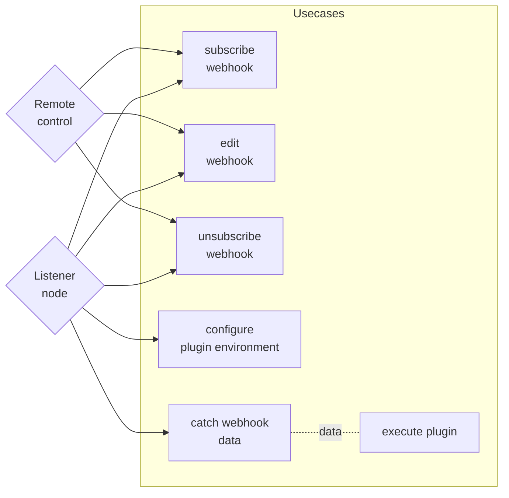

## Basic concept

```mermaid
flowchart LR
    U(Listener owner)
    L{Node}
    l_api[listener<br/>endpoint]
    ark{Blockchain<br/>node}
    plg1([plugin])
    whk>webhook]
    BC{Blockchain<br/>node}
    t_api[blockchain<br/>api]

    U -..->|remote control| L

    ark <-.->|webhook<br/>subscription| L
    subgraph Ark ecosystem
        ark === whk
    end

    subgraph Targeted ecosystem
        t_api === BC
    end

    subgraph Listener
        l_api --> plg1
        L ==> plg1
    end

    whk -.->|data| l_api
    plg1 -.->|call| t_api
```

## Usecases

```mermaid
flowchart LR
    L{Listener<br/>node}
    R{Remote<br/>control}

    subgraph Usecases
        UC1[subscribe<br/>webhook]
        UC11[edit<br/>webhook]
        UC2[unsubscribe<br/>webhook]
        UC3[configure<br/>plugin environment]
        UC4[execute plugin]
        UC5[catch webhook<br/>data]
        UC5 -.-|data| UC4
    end

    L --> UC3
    L --> UC5
    L & R --> UC1
    L & R --> UC11
    L & R --> UC2
```
